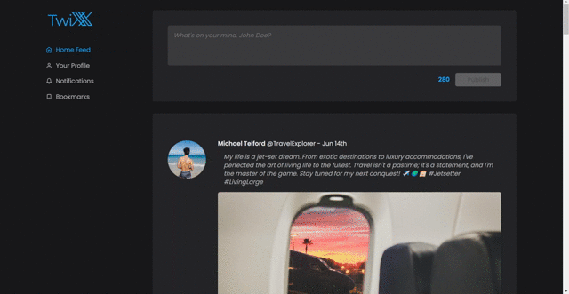
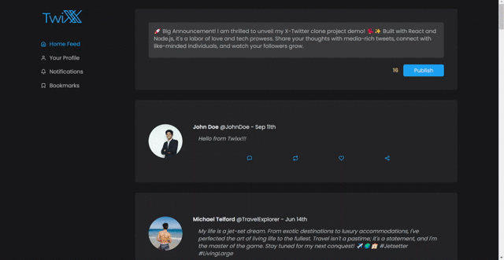

# ⚡ TWIXX (Twitter-X clone project)

## 🟢 About

The main goal behind this project was to enhance my front-end skills by creating an X (Twitter) clone using React. I worked on this project independently, focusing on designing and building the user interface inspired by the X-Twitter UX. I took on the challenge of developing the frontend to match an already working backend. My mission was to design the user interface and make sure it worked smoothly with the existing backend system.

<!--  -->

## 🟢 Features

<!-- - DOM manipulation after state changes (true, false or null).
- Store orders locally and make them accessible at /order/:orderId.
- Secret /admin page to view, update, or delete orders.
- The order form for modification is pre-filled with the stored data. -->

## 🟢 Demo
<!-- 
\

\

\
 -->

## 🟢 Project Setup
#### Server side: 
1. Open a terminal in VS Code
2. Navigate to the server directory with `cd server`
3. Type `yarn install`
4. Use `yarn start` to run the environment

#### Client side:
1. Open a second terminal
2. Navigate to the client directory
3. Type `yarn install`
4. Use `yarn start` to run the frontend environment
