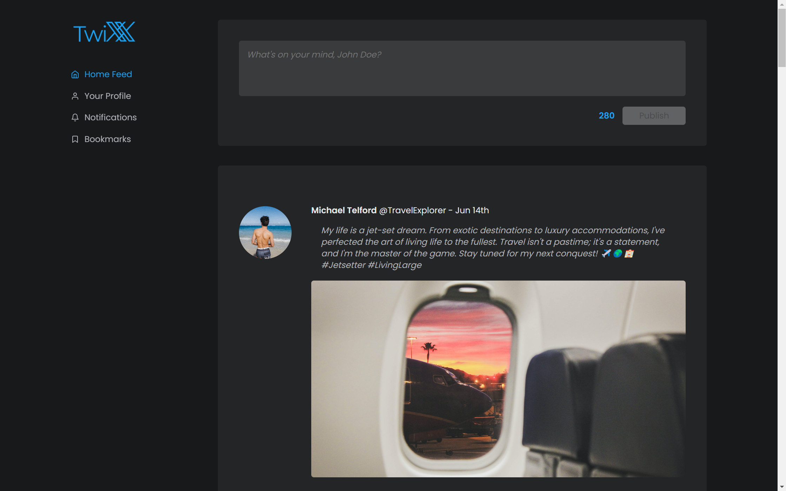

# ⚡ TWIXX (Twitter-X clone project)

 

## 🟢 About

The main goal behind this project was to enhance my front-end skills by creating an X (Twitter) clone using React. I worked on this project independently, focusing on designing and building the user interface inspired by the X-Twitter UX. I took on the challenge of developing the frontend to match an already working backend. My mission was to design the user interface and make sure it worked smoothly with the existing backend system. 

I created the database myself, and I had to tweak the backend my way to add some features such as Likes and Media tabs filters.

 

## 🟢 Features

- Tweet Posting: Users can compose and post tweets, including character limits and real-time updates.
- Timeline and Feeds: User's personalized timeline including tweets from people they follow and relevant trending topics.
- User Profiles: Profile pictures, bio, and the ability to filter by Tweets, Media or Liked tweets.
- Users can interact with tweets by liking, retweeting, and viewing tweet engagement statistics

 

## 🟢 Demo
https://github.com/fg-codes/Twixx_Twitter-X_clone_project/assets/114963609/93ee51f6-1387-4ce7-bbb9-df1b29b8021a

 

## 🟢 Project Setup
#### Server side: 
1. Open a terminal in VS Code
2. Navigate to the server directory with `cd server`
3. Type `yarn install`
4. Use `yarn start` to run the environment

#### Client side:
1. Open a second terminal
2. Navigate to the client directory
3. Type `yarn install`
4. Use `yarn start` to run the frontend environment
